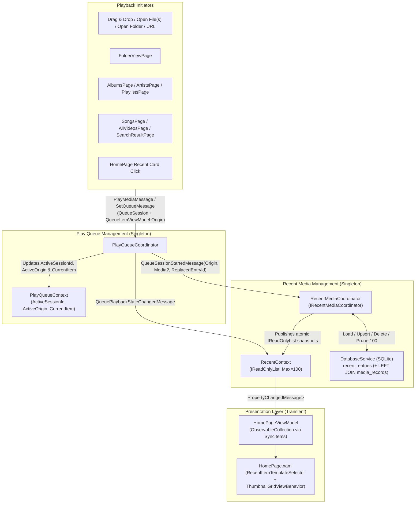

# 🕒 Recent Media Tracking System

This document describes the architecture, data model, queue session lifecycle, and UI behavior of the Recent Media tracking system on the Home page (`HomePage.xaml`).

---

## 📋 Table of Contents

- [📖 Overview](#-overview)
- [🏗️ Architecture & Components](#️-architecture--components)
- [📦 Supported Recent Entry Types (`IRecentItem`)](#-supported-recent-entry-types-irecentitem)
- [🔄 Queue Session Lifecycle & Tracking Rules](#-queue-session-lifecycle--tracking-rules)
  - [Container vs. Individual Item Tracking](#container-vs-individual-item-tracking)
  - [Loose Multi-File Queues & 1-Item Rules](#loose-multi-file-queues--1-item-rules)
  - [Deferred Session Upgrades](#deferred-session-upgrades)
  - [In-Queue Mutations & Origin Unlinking](#in-queue-mutations--origin-unlinking)
- [🔑 Deduplication & Live Re-Playback Semantics](#-deduplication--live-re-playback-semantics)
- [⚡ Active & Playing State Synchronization](#-active--playing-state-synchronization)
- [💾 SQLite Persistence & UWP File Access](#-sqlite-persistence--uwp-file-access)

---

## 📖 Overview

Screenbox's Recent Media system records **shortcuts to live queue origins** rather than play queue snapshots or raw Windows MRU (`MostRecentlyUsedList`) entries.

Key characteristics:
- **Capacity**: Up to **100 items** (`RecentContext.MaxRecentItems = 100`), ordered by `last_played DESC`.
- **Live Origin Shortcuts**: Recent entries represent live sources—a single file/URL (`MediaViewModel`), Folder or `.m3u`/`.m3u8` playlist file (`MediaCollectionViewModel`), User Playlist (`PlaylistViewModel`), Album (`AlbumViewModel`), or Artist (`ArtistViewModel`). Re-opening any container card resolves and plays its **current live contents** (e.g., new files added to a folder or new songs added under an artist).
- **Single-Table Shortcut Storage**: All five entry types persist exclusively in a single `recent_entries` table. `SingleMedia` entries enrich metadata at startup via a single `LEFT JOIN media_records` query without duplicate child rows.
- **Queue Mutation Unlinking**: Advancing (`Next`/`Previous`), shuffling/unshuffling, or reordering items inside an active container session preserves its `QueueOrigin`. Adding or removing items from the queue unlinks the container origin so subsequent track navigations record played tracks individually.
- **UI-Driven Thumbnail Loading**: `HomePage.xaml` attaches `ThumbnailGridViewBehavior` to `RecentFilesGridView` so thumbnails load lazily only for realized/visible containers (`AlbumViewModel.LoadAlbumArtAsync()` decodes only `RelatedSongs[0]`).

---

## 🏗️ Architecture & Components

Because `HomePageViewModel` is transient and only alive while the user is viewing the Home page, recent entry persistence, deferred library/playlist linking, and queue-session recording are owned by a singleton coordinator (`RecentMediaCoordinator`).

```mermaid
flowchart TD
    subgraph PlaybackInitiators["Playback Initiators"]
        Drop["Drag & Drop / Open File(s) / Open Folder / URL"]
        FolderView["FolderViewPage"]
        Library["AlbumsPage / ArtistsPage / PlaylistsPage"]
        LibWide["SongsPage / AllVideosPage / SearchResultPage"]
        HomeCard["HomePage Recent Card Click"]
    end

    subgraph CoreQueue["Play Queue Management (Singleton)"]
        PQC["PlayQueueCoordinator"]
        PQContext["PlayQueueContext\n(ActiveSessionId, ActiveOrigin, CurrentItem)"]
    end

    subgraph RecentManagement["Recent Media Management (Singleton)"]
        RMC["RecentMediaCoordinator\n(IRecentMediaCoordinator)"]
        RContext["RecentContext\n(IReadOnlyList<IRecentItem>, Max=100)"]
        DB["DatabaseService (SQLite)\nrecent_entries (+ LEFT JOIN media_records)"]
    end

    subgraph UI["Presentation Layer (Transient)"]
        HPVM["HomePageViewModel\n(ObservableCollection<IRecentItem> via SyncItems)"]
        HP["HomePage.xaml\n(RecentItemTemplateSelector + ThumbnailGridViewBehavior)"]
    end

    PlaybackInitiators -->|"PlayMediaMessage / SetQueueMessage\n(QueueSession + QueueItemViewModel.Origin)"| PQC
    PQC -->|"Updates ActiveSessionId, ActiveOrigin & CurrentItem"| PQContext
    PQC -->|"QueuePlaybackStateChangedMessage"| RContext
    PQC -->|"QueueSessionStartedMessage(Origin, Media?, ReplacedEntryId)"| RMC
    RMC <-->|"Load / Upsert / Delete / Prune 100"| DB
    RMC -->|"Publishes atomic IReadOnlyList<IRecentItem> snapshots"| RContext
    RContext -->|"PropertyChangedMessage<IReadOnlyList<IRecentItem>>"| HPVM
    HPVM --> HP
```

| Component | Lifetime | Responsibility |
|---|---|---|
| `IRecentItem` | Interface | Minimal shared contract (`INotifyPropertyChanged`, `Name`, `IsPlaying`) implemented by `RecentMediaItemViewModel`, `MediaCollectionViewModel`, `PlaylistViewModel`, `AlbumViewModel`, and `ArtistViewModel`. |
| `RecentMediaItemViewModel` | Per single-media card | Lightweight `IMediaContainer` + `IMediaPlaybackState` wrapper around canonical `MediaViewModel` that tracks individual active/playing state via `QueuePlaybackStateChangedMessage`. |
| `QueueItemViewModel` | Per queue slot | Wraps canonical `MediaViewModel` with slot playback state and optional container `Origin` (`QueueOrigin?`). |
| `QueueOrigin` | Immutable record | Describes the source container (`Kind`, `SourceId`, `Title`, `Subtitle`, `Token`, `TrackItemsIndividually`). |
| `PlayQueueCoordinator` | Singleton | Owns the active `QueueSession`, updates `PlayQueueContext` (`ActiveOrigin = CurrentItem?.Origin`), and broadcasts `QueueSessionStartedMessage` / `QueuePlaybackStateChangedMessage`. |
| `RecentMediaCoordinator` | Singleton | Listens to `QueueSessionStartedMessage`, `PropertyChangedMessage<MusicLibrary>` (reloading on scan completion), and `Playlists.CollectionChanged` (`Remove`); skips recording/loading when `GeneralSettings.ShowRecent` is off; builds local item lists per operation (displaying non-playable empty ViewModels when libraries/playlists are not yet loaded, then replacing them and reusing `MediaCollectionViewModel` / `MediaViewModel` instances on `LoadAsync(forceReload: true)`), publishes atomic snapshots to `RecentContext.Recent`, and persists entries to `recent_entries`. |
| `RecentContext` | Singleton | Observable recipient holding the snapshot `IReadOnlyList<IRecentItem> Recent` (`[NotifyPropertyChangedRecipients]`) and `MaxRecentItems = 100`. |
| `MediaCollectionViewModel` | Per folder / `.m3u` card | Lightweight ViewModel representing a live Folder or playlist-file (`.m3u`/`.m3u8`/URI) shortcut; resolves live items on demand via MRU token and `IQueueService`. |
| `HomePageViewModel` | Transient | Maintains a local `ObservableCollection<IRecentItem> Recent` synced from `RecentContext.Recent` via `SyncItems()` + `TryExecuteOrEnqueue()`, and handles `Play`, `PlayNext`, `AddToQueue`, `Remove`, context flyout resolution, and multi-select actions via pattern matching on `IRecentItem`. |
| `RecentItemTemplateSelector` | UI Selector | Maps each `IRecentItem` concrete type to its strongly-typed template in `GridViewItemTemplates.xaml`. |

---

## 📦 Supported Recent Entry Types (`IRecentItem`)

| `RecentItemKind` | Concrete ViewModel | Trigger Scenarios | Home Card Template | Startup Hydration Source |
|---|---|---|---|---|
| `SingleMedia` (`0`) | `MediaViewModel` | Single local file, network/stream URL, loose multi-file track playback, or individual track from a library-wide queue (`SongsPage`, `AllVideosPage`, `SearchResultPage` songs). | `MediaGridViewItemTemplate` | `recent_entries` (`token` + `LEFT JOIN media_records`) |
| `MediaCollection` (`1`) | `MediaCollectionViewModel` | Dropped/opened Folder (`StorageFolder`), auto-enqueued neighboring folder ($\ge 2$ playable files), `.m3u`/`.m3u8` playlist file, or URL with sub-items. | `MediaCollectionGridViewItemTemplate` (`FolderGlyph` / `PlaylistGlyph`) | `recent_entries` (path + MRU `token`) |
| `Playlist` (`2`) | `PlaylistViewModel` | Playing a saved playlist from `PlaylistsPage` or `PlaylistDetailsPage`. | `PlaylistGridViewItemTemplate` (`PlaylistGlyph`) | Resolved/swapped live from `PlaylistsContext.Playlists` |
| `Album` (`3`) | `AlbumViewModel` | Playing an album from `AlbumsPage`, `AlbumDetailsPage`, or `SearchResultPage`. | `AlbumGridViewItemTemplate` | Resolved/swapped live from `LibraryContext.Music.Albums` |
| `Artist` (`4`) | `ArtistViewModel` | Playing an artist from `ArtistsPage`, `ArtistDetailsPage`, or `SearchResultPage`. | `ArtistGridViewItemTemplate` | Resolved/swapped live from `LibraryContext.Music.Artists` |

---

## 🔄 Queue Session Lifecycle & Tracking Rules

### Container vs. Individual Item Tracking

`QueueOrigin.TrackItemsIndividually` determines whether a queue session is tracked as a single container shortcut or per track:

1. **Container Sessions (`TrackItemsIndividually == false`)**:
   - Applies to `Playlist`, `Album`, `Artist`, and `MediaCollection` when `SourceId` is non-empty (Folder, playlist file, or expandable URL).
   - Recorded **once** when the queue session starts (`ApplyQueueSnapshot`).
   - Advancing (`Next`/`Previous`), auto-advancing on media end, or selecting another track inside the Play Queue (`PlayMediaMessage(item, existing: true)`) preserves `SessionId` and `Origin` and **does not** add child tracks to Recent.

2. **Individual Track Sessions (`TrackItemsIndividually == true` or `Origin == null`)**:
   - Applies to `SingleMedia`, library-wide queues (`QueueOrigin.ForLibraryQueue`), loose multi-file selections/drops, and unlinked modified queues.
   - Recorded in `ProcessCurrentItemChangedAsync` whenever `PlayQueueContext.CurrentItem` changes, adding or promoting each navigated track individually as a `SingleMedia` card.

### Loose Multi-File Queues & 1-Item Rules

| User Action | Playable Files Count | Recorded Entry | Rationale |
|---|---|---|---|
| Drop a folder or use **Open Folder** | $\ge 1$ | `MediaCollection` (Folder shortcut) | Explicit folder origin; clicking reloads live folder contents. |
| Drop or open an `.m3u`/`.m3u8` playlist file | $\ge 1$ | `MediaCollection` (Playlist file shortcut) | Explicit playlist file origin; clicking re-expands live file contents. |
| Play a `Playlist`, `Album`, or `Artist` | $\ge 1$ | `Playlist` / `Album` / `Artist` | Explicit live container. |
| Drop or pick multiple loose files, or multi-select **Play** | $\ge 2$ | Tracks played item(s) as `SingleMedia` | No persistent folder or playlist origin exists on disk to shortcut to. |
| Open/drop a single file (with `EnqueueAllFilesInFolder` enabled) | $1$ | `SingleMedia` | Only playable file in the folder. |
| Open/drop a single file (with `EnqueueAllFilesInFolder` enabled) | $\ge 2$ | `MediaCollection` (Folder shortcut) | Neighboring files expanded into a folder session (`ReplacedEntryId` set). |

### Deferred Session Upgrades

Two playback flows start as a 1-item `SingleMedia` queue and asynchronously expand within the **same** `SessionId`:

1. **Neighboring Files Auto-Enqueue (`MessengerExtensions.PlayFilesAsync` → `QueueService.AddNeighboringFilesAsync`)**:
   - `PlayFilesAsync` immediately sends a 1-item `SetQueueMessage` (`SingleMedia`) so playback begins immediately.
   - `AddNeighboringFilesAsync` enumerates the parent folder; if $> 1$ playable files are found, it updates `Origin = QueueOrigin.ForMediaCollection(folderName, folderPath, folderToken)` within the same `SessionId`.
2. **Expandable URL Sub-Items (`PlayQueueCoordinator.CheckSubItemsAsync`)**:
   - Opening a URL starts as an individual slot (`Origin == null`). If LibVLC parses $> 1$ sub-items, `CheckSubItemsAsync` replaces that slot with `QueueItemViewModel`s carrying `MediaCollection(title, url)` within the same `SessionId`.

When `PlayQueueCoordinator` detects `_recordedSessionId == queueSession.SessionId` transitioning from `SingleMedia` to `MediaCollection`, it sends `QueueSessionStartedMessage(Origin, ReplacedEntryId: _lastRecordedEntryId)`, replacing the original temporary `SingleMedia` entry in-place with the `MediaCollectionViewModel` shortcut.

### Per-Item Origin & Mixed-Origin Queues

Each `QueueItemViewModel` slot carries its own optional container `Origin` (`QueueOrigin?`; `null` indicates an individually tracked item):

- **Preserved across all queue mutations**:
  - `Next` / `Previous` track navigation, shuffling/unshuffling, reordering, `Remove`, `Enqueue`, `InsertNext`, and `SendPlayNext` / `SendAddToQueue` all preserve existing items' `Origin` without unlinking.
  - Newly inserted container items (e.g. `Play Next` or `Add to Queue` on an Album, Artist, Playlist, or MediaCollection) stamp their own `QueueOrigin` onto the inserted `QueueItemViewModel` slots; individual items leave `Origin = null`.
- **Active origin and recent recording**:
  - `PlayQueueContext.ActiveOrigin` always reflects `_context.CurrentItem?.Origin`.
  - When playback transitions between tracks of the same container origin within a session, no duplicate `QueueSessionStartedMessage` is emitted.
  - When playback advances into an item from a different origin (e.g., from an Album into a queued Playlist or single track), `ActiveOrigin` updates, the previous container card deactivates, the new container (or `RecentMediaItemViewModel`) activates, and the new origin is recorded/promoted in Recent Media. Clearing the queue (`ClearQueue()`) resets `ActiveSessionId = Guid.Empty` and `ActiveOrigin = null`.

---

## 🔑 Deduplication & Live Re-Playback Semantics

Every entry computes a deterministic `id` key via `QueueOrigin.GetEntryId()` (`$"{(int)Kind}|{NormalizeLocation(SourceId)}"`):

| `RecentItemKind` | Source Key (`SourceId`) | Re-Playback Behavior from Home Page |
|---|---|---|
| `SingleMedia` | File path or URL | Resolves cached `MediaViewModel` (reopening picker MRU token if outside libraries) and sends `PlayMediaMessage(media, existing: false)`. |
| `MediaCollection` | Folder path, `.m3u` file path, or URL | Resolves live `StorageFolder` / `StorageFile` (via retained MRU `Token` or path fallback) and parses current live items via `IQueueService`. |
| `Playlist` | `PlaylistViewModel.Id` | Invokes `PlaylistViewModel.PlayCommand` using current live `PlaylistViewModel.Items`. |
| `Album` | `AlbumViewModel.AlbumKey` | Invokes `AlbumViewModel.PlayAlbumCommand` using current live `AlbumViewModel.OrderedSongs`. |
| `Artist` | `ArtistViewModel.ArtistKey` | Invokes `ArtistViewModel.PlayArtistCommand` using current live `ArtistViewModel.OrderedSongs`. |

---

## ⚡ Active & Playing State Synchronization

Only **one** card in the Recent list displays the active playing badge at any time:

- **`AlbumViewModel`, `ArtistViewModel`, `PlaylistViewModel`, and `MediaCollectionViewModel`** each listen to `QueuePlaybackStateChangedMessage` and set:
  - `IsQueueActive = state.SessionId != Guid.Empty && state.CurrentItem is not null && (state.Origin?.Matches(kind, sourceId) ?? false)`
  - `IsPlaying = IsQueueActive && state.IsPlaying`
- **`RecentMediaItemViewModel`** (`IMediaContainer` + `IMediaPlaybackState`) wraps canonical `MediaViewModel` for `SingleMedia` cards and listens to `QueuePlaybackStateChangedMessage`:
  - `IsMediaActive = state.SessionId != Guid.Empty && state.CurrentItem is not null && (state.Origin is null || state.Origin.TrackItemsIndividually) && matches Media`
  - `IsPlaying = IsMediaActive && state.IsPlaying`
  - `MediaViewModel` stays completely free of HomePage-specific state (retaining `IsPlaying` strictly for track-level UI), and `MediaMenuFlyout` handles `RecentMediaItemViewModel` out of the box via `IMediaContainer` and `IMediaPlaybackState`.
  - When a track inside an Album/Artist/Playlist/Folder is playing, only that container card shows the Pause badge (`RecentMediaItemViewModel.IsMediaActive` is `false`), and clicking a `SingleMedia` card starts it standalone instead of pausing the container queue.

---

## 💾 SQLite Persistence & UWP File Access

### Database Table (`screenbox.db`)

`recent_entries` is a replaceable cache table managed in `DatabaseService.Schema.cs` and `DatabaseService.Recent.cs`:

- **`recent_entries`**:
  - `id` (`TEXT PRIMARY KEY`), `kind` (`INTEGER`), `source_id` (`TEXT`), `title` (`TEXT`), `subtitle` (`TEXT`), `token` (`TEXT`), `last_played` (`INTEGER`, UTC ticks).
  - Loaded in a **single query** with `LEFT JOIN media_records ON re.kind = @singleKind AND mr.path = re.source_id` so library-indexed `SingleMedia` entries hydrate cached metadata without disk I/O.

### UWP Sandbox Access (`MostRecentlyUsedList`)

Because Screenbox runs in the UWP app container without `broadFileSystemAccess`, files and folders outside the Music/Videos libraries require OS-level capability tokens across app restarts. Because `MostRecentlyUsedList` is capped at 25 entries, only top-level persisted recent shortcuts register tokens:
- **Single files (`SingleMedia`)**: `RecentMediaCoordinator.EnsureFileAccessToken` retains the file's MRU token in `recent_entries.token` and `IFileMediaSource.Token`, reopening `StorageFile` via `MostRecentlyUsedList.GetFileAsync(token)` on startup hydration.
- **Folders and playlist files (`MediaCollection`)**: `QueueService` captures the MRU token returned by `IFilesService.AddToRecent(item)` into `QueueOrigin.Token`, which `RecentMediaCoordinator` stores in `recent_entries.token`. On startup hydration, `MediaCollectionViewModel` uses `MostRecentlyUsedList.GetFolderAsync(token)` or `GetFileAsync(token)` to access live folder/playlist contents across sessions.
- SQLite owns the entire recent list history and ordering; tracks played inside container sessions do not overwrite MRU slots.
